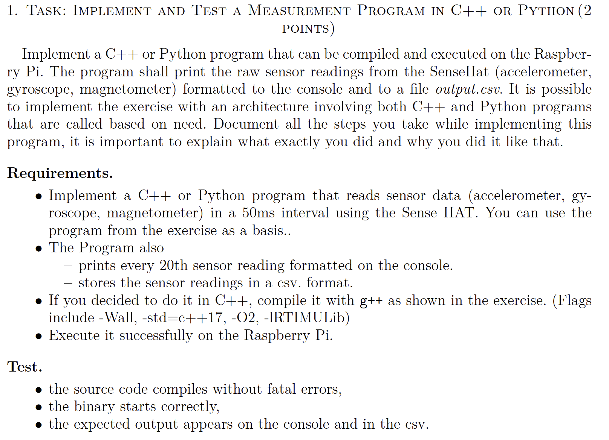
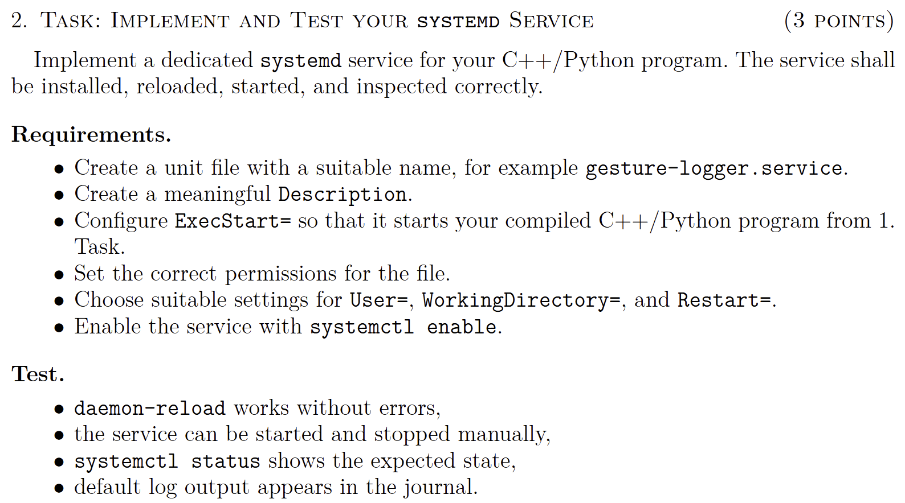
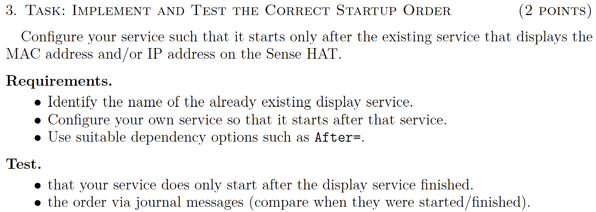
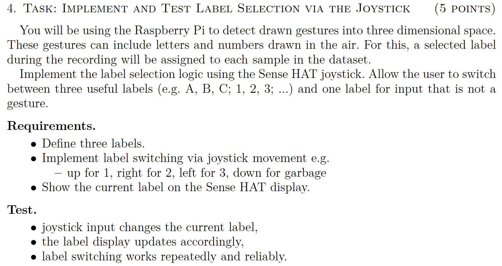
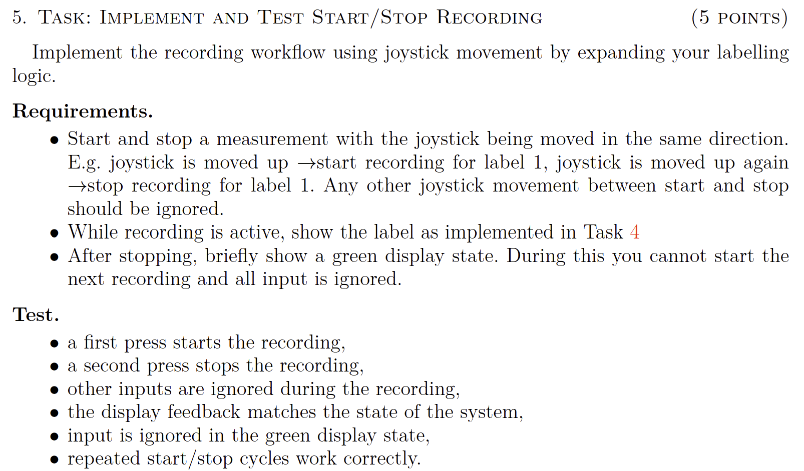
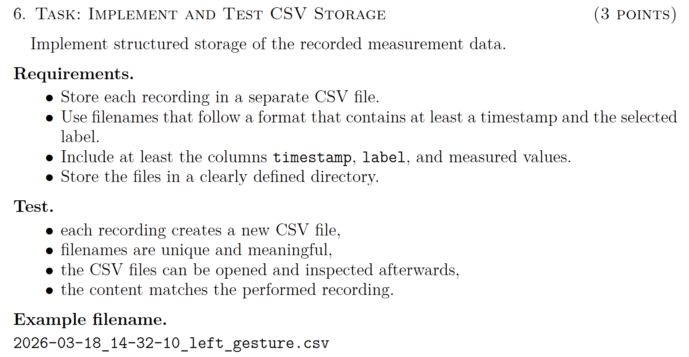
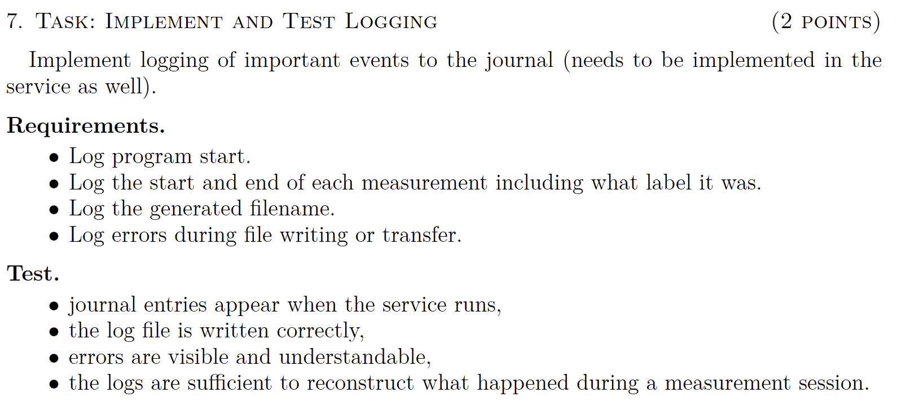
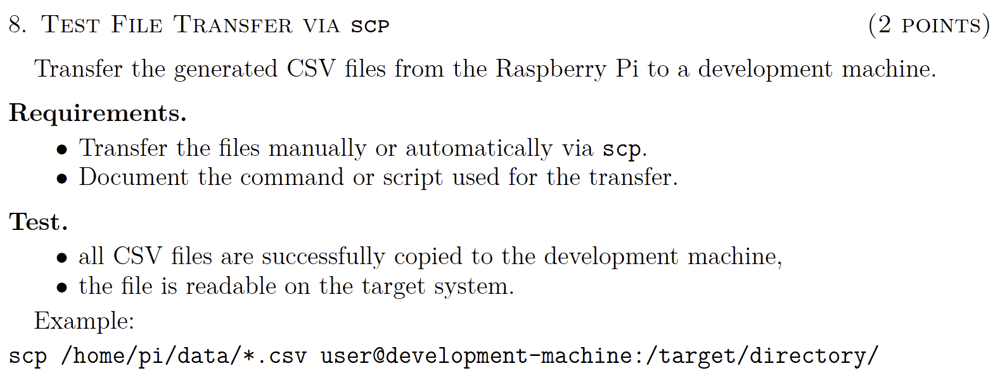

# Task 1


Implemented in C++ because we did the majority of the code already in c++ which made very little change necessary. We renamed the output file to "output.csv" and added a loop that prints every 20th reading via a simple counter variable, because that is the simplest way to do it which is also rather robust.

Command to exectute the code [in the folder where the file is located]: 
```bash
g++ -Wall -std=c++17 -O2 logger.cpp -o logger -I /usr/include/RTIMULib -lRTIMULib -lpthread
```
this creates an executable called "logger" which can be run with 
```bash
./logger
```

to stop press 
```bash
crtl + c
```

# Task 2


Creating the file service via 

```bash
sudo nano /etc/systemd/system/logger.service
```

contents of file:
```bash
[Unit]
Description=IMU Logger Service. Runs the logger executable to log IMU data to a csv file. Done for assignment 2.

[Service]
ExecStart=/home/kit-18/Documents/EAI/EAI4-Babsi-Bobby-Collab/Assignments/Lesson_04/logger
WorkingDirectory=/home/kit-18/Documents/EAI/EAI4-Babsi-Bobby-Collab/Assignments/Lesson_04
User=kit-18
Restart=always

[Install]
WantedBy=multi-user.target
```

reload system via 
```bash
sudo systemctl daemon-reload
```

start service via 
```bash
sudo systemctl start logger.service
```

checked whether it works or not via:
```bash
systemctl status logger.service
```

stopping it:
```bash
sudo systemctl stop logger.service
```

view program journal log:
```bash
journalctl -u logger.service
```

# Task 3


command to find all running services:
```bash
systemctl list-units --type=service
```

trying to search directly for our service:
```bash
systemctl list-units --type=service | grep -i sense
```
and then also just in case tried:
```bash
systemctl list-units --type=service | grep -i display
```

exact name that was found: **sensehat-host-ip.service**

open service file:
```bash
sudo nano /etc/systemd/system/logger.service
```

edited the file to include the line AFTER
```bash
[Unit]
Description=IMU Logger Service
After=sensehat-host-ip.service

[Service]
ExecStart=/home/kit-18/Documents/EAI/EAI4-Babsi-Bobby-Collab/Assignments/Lesson_04/logger
WorkingDirectory=/home/kit-18/Documents/EAI/EAI4-Babsi-Bobby-Collab/Assignments/Lesson_04
User=kit-18
Restart=always

[Install]
WantedBy=multi-user.target
```

reload system via 
```bash
sudo systemctl daemon-reload
```

restart service via 
```bash
sudo systemctl restart logger.service
```

check logs:
```bash
journalctl -u logger.service
```

```bash
journalctl -u sensehat-host-ip.service
```

or what made it clearler was actually getting the timestamps:
```bash
journalctl -b | grep -E "logger|host-ip"
```

# Task 4


# Task 5


# Task 6


# Task 7


# Task 8
