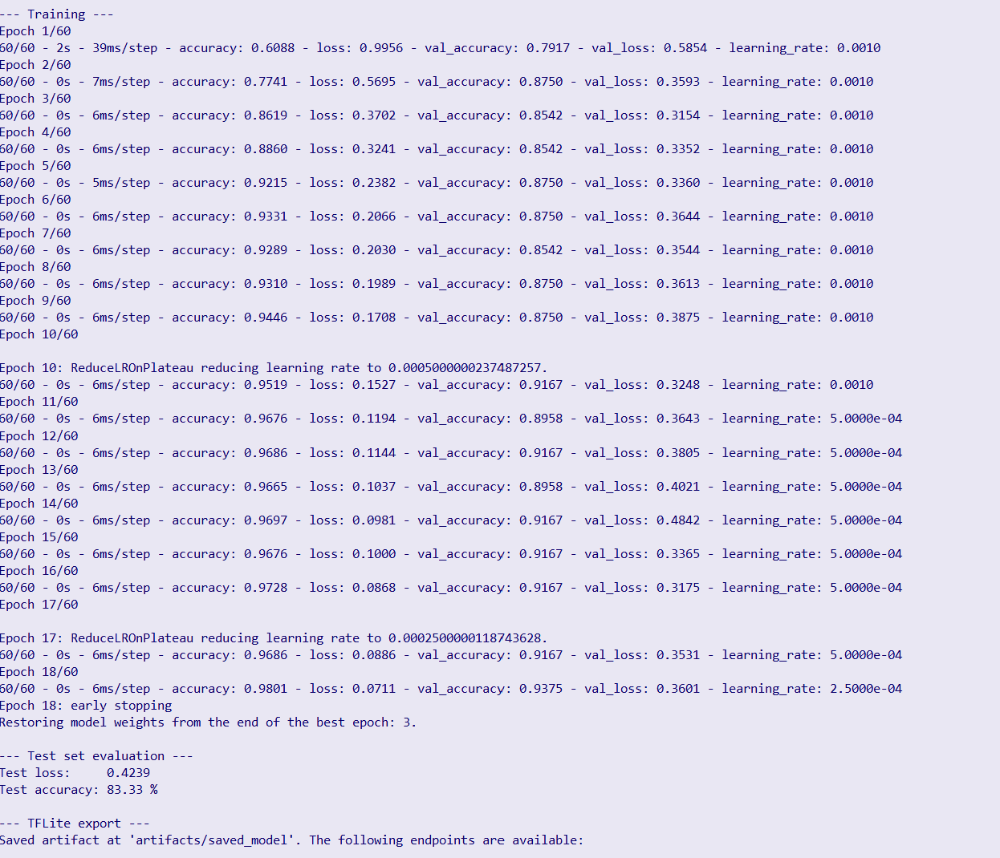

# Step 1

Copy execute file "logger_recorder" from HW02 to HW03

# Step 2

record data (estimated time: 82374283576352 hours) after activating the venv via

```bash
(.venv) kit-18@kit-18:~/Documents/EAI/EAI4-Babsi-Bobby-Collab/Assignments/HW03 $ python3 video_recording.py 
```

# Step 3

Clean recording data via executing the clean_recording.py

```bash
(.venv) kit-18@kit-18:~/Documents/EAI/EAI4-Babsi-Bobby-Collab/Assignments/HW03 $ python3 clean_recordings.py 
```

# Step 4

write train_and_convert.py and put into docker container in the scripts folder. Replace it with the old one. Add data_sync.py

# Step 5

Inside the docker container execute in a bash

```bash
sudo apt update
sudo apt install -y rsync openssh-client
```

verify over

```bash
rsync --version
ssh -V
```

# Step 6

test whether all connections work via: 
```bash
rsync -avz kit-18@10.42.0.1:/home/kit-18/Documents/EAI/EAI4-Babsi-Bobby-C
ollab/Assignments/HW03/recordings_clean/ ./recordings_clean/
```

This is for testing purposes and will briefly copy all the data if it works.

# Step 7

Change makefile to this:

```makefile
SHELL := /usr/bin/env bash
.SHELLFLAGS := -eu -o pipefail -c
MAKEFLAGS += --no-builtin-rules

-include .env

APP_NAME ?= mnist_sensehat_demo
ARTIFACT_DIR ?= artifacts
BUILD_DIR ?= build

BUILD_JOBS ?= $(shell nproc 2>/dev/null || getconf _NPROCESSORS_ONLN 2>/dev/null || echo 4)

TFLITE_SRC_DIR ?= third_party/tensorflow-src
TF_TAG ?= v2.16.1

PYTHON_BIN ?= .venv/bin/python
PIP_BIN ?= .venv/bin/pip

TRAIN_ARGS ?=

# -----------------------------
# ADDED FOR TASK HW 03 dataset + remote sync
# -----------------------------
DATA_DIR ?= recordings
REMOTE_DATA ?=

VENV_STAMP := .venv/.deps-stamp

MAKEFLAGS += -j$(BUILD_JOBS)
export CMAKE_BUILD_PARALLEL_LEVEL := $(BUILD_JOBS)

APP_BINARY := $(BUILD_DIR)/$(APP_NAME)
MODEL_FILE := $(ARTIFACT_DIR)/model.tflite

TFLITE_READY := $(TFLITE_SRC_DIR)/.source-ready
ARTIFACT_DIR_STAMP := $(ARTIFACT_DIR)/.dir-stamp
BUILD_DIR_STAMP := $(BUILD_DIR)/.dir-stamp

CPP_SOURCES := $(shell find src -type f \( -name '*.cpp' -o -name '*.h' \) 2>/dev/null)

.PHONY: all train sync tflite build deploy run perf perf-report provision-pi console clean

all: deploy

# -----------------------------
# directories
# -----------------------------
$(ARTIFACT_DIR_STAMP):
	mkdir -p "$(ARTIFACT_DIR)"
	touch "$@"

$(BUILD_DIR_STAMP):
	mkdir -p "$(BUILD_DIR)"
	touch "$@"

# -----------------------------
# python environment
# -----------------------------
$(VENV_STAMP): requirements.txt
	if [[ ! -x "$(PYTHON_BIN)" ]]; then python3 -m venv .venv; fi
	"$(PYTHON_BIN)" -m pip install --upgrade pip setuptools wheel
	"$(PIP_BIN)" install -r requirements.txt
	touch "$@"

# -----------------------------
# NEW: sync dataset from Raspberry Pi
# -----------------------------
sync:
	@if [ -n "$(REMOTE_DATA)" ]; then \
		echo "[sync] pulling from $(REMOTE_DATA) -> $(DATA_DIR)"; \
		mkdir -p "$(DATA_DIR)"; \
		rsync -avz "$(REMOTE_DATA)" "$(DATA_DIR)/"; \
	else \
		echo "[sync] REMOTE_DATA not set, skipping sync"; \
	fi

# -----------------------------
# model training (now uses DATA_DIR)
# -----------------------------
$(MODEL_FILE): scripts/train_and_convert.py requirements.txt $(VENV_STAMP) | $(ARTIFACT_DIR_STAMP)
	"$(PYTHON_BIN)" scripts/train_and_convert.py \
		--artifacts-dir "$(ARTIFACT_DIR)" \
		--data-dir "$(DATA_DIR)" \
		$(TRAIN_ARGS)

# IMPORTANT: training depends on sync
train: sync $(MODEL_FILE)

# -----------------------------
# TFLite source management
# -----------------------------
$(TFLITE_READY): scripts/ensure_tflite_source.sh .env
	bash scripts/ensure_tflite_source.sh

tflite: $(TFLITE_READY)

# -----------------------------
# C++ build
# -----------------------------
$(APP_BINARY): CMakeLists.txt toolchains/aarch64.cmake $(CPP_SOURCES) $(TFLITE_READY) | $(BUILD_DIR_STAMP)
	cmake -S . -B "$(BUILD_DIR)" -G Ninja \
	  -DCMAKE_TOOLCHAIN_FILE="$(abspath toolchains/aarch64.cmake)" \
	  -DCMAKE_BUILD_TYPE=Debug \
	  -DCMAKE_EXPORT_COMPILE_COMMANDS=ON \
	  -DAPP_NAME="$(APP_NAME)" \
	  -DTFLITE_SRC_DIR="$(abspath $(TFLITE_SRC_DIR))"
	cmake --build "$(BUILD_DIR)" --parallel "$(BUILD_JOBS)" --target "$(APP_NAME)"

build: $(APP_BINARY)

# -----------------------------
# deployment / runtime
# -----------------------------
deploy: $(APP_BINARY) $(MODEL_FILE)
	bash scripts/deploy_to_pi.sh

run: $(APP_BINARY) $(MODEL_FILE)
	bash scripts/run_on_pi.sh

perf: $(APP_BINARY) $(MODEL_FILE)
	bash scripts/run_perf_on_pi.sh

perf-report:
	"$(PYTHON_BIN)" scripts/parse_perf_results.py \
		--input-dir "$(ARTIFACT_DIR)/perf" \
		--model-metrics "$(ARTIFACT_DIR)/model_metrics.csv" \
		--output "$(ARTIFACT_DIR)/perf/results_table.csv"

# -----------------------------
# utilities
# -----------------------------
provision-pi:
	bash scripts/provision_pi.sh

console:
	bash scripts/open_pi_console.sh

clean:
	rm -rf "$(BUILD_DIR)" "$(ARTIFACT_DIR)" \
	       "third_party/tensorflow-src" \
	       "third_party/litert-build" \
	       "third_party/litert"
```

# Step 8

Execute in bash

```bash
make train REMOTE_DATA=kit-18@10.42.0.1:/home/kit-18/Documents/EAI/EAI4-Babsi-Bobby-Collab/Assignments/HW03/recordings_clean/
```

