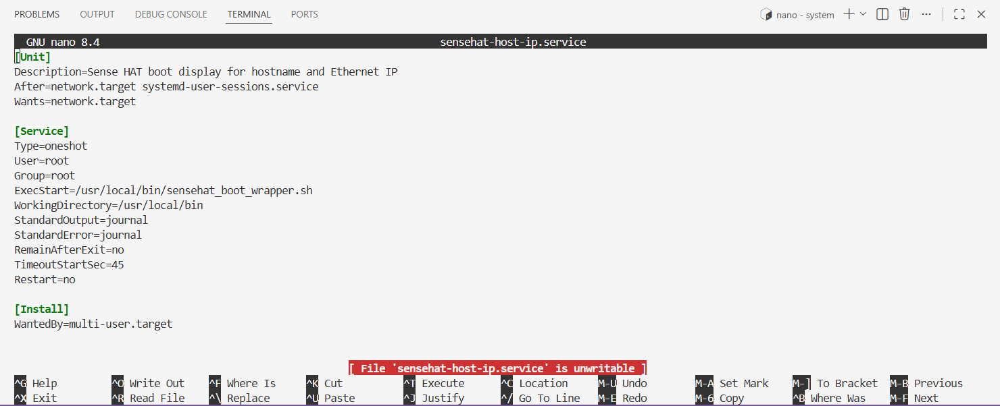
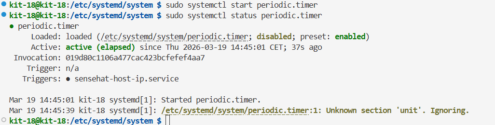

# Exercise 3: Theory / Cheat sheet
**Date:** 19.03.2026  

### Commands 
```bash
sudo systemd-analyze

sudo systemd-analyze critical-path

sudo systemd-analyze critical-chain
```

**Go to:**
```bash
cd /etc/systemd/system

nano sensehat-host-ip.service
```
- this should open the following:



```bash
cd multi-user.target.wants
```

**Shellscript**
```bash
cd /usr/local/bin

nano sensehat_boot_wrapper.sh

nano sensehat_show_host_ip.py
```
- don't have to understand everything
- is complicated stuff

### Everthing below is done in `cd /etc/systemd/system`
**Service check**
```bash
cd /etc/systemd/system
sudo systemctl status sensehat-host-ip.service
```
- check state of some service

**Change something in the service**
```bash
sudo nano sensehat-host-ip.service

sude systemctl status sensehat-host-ip.service
```
- sudo to persist the changes
- change something to see if it is applied in real time
- 


**Creating a customed service**
```bash
sudo systemctl start sensehat-host-ip.service

journalctl -u sensehat-host-ip.service -n 50
```

### These commands are important
**systemctl**
- start
- stop
- restart
- status
- enable
- disable

**journalctl**

### Change Directory

```bash
cd /usr/local/bin/

ls -la
```

### Looking at timers (Journal)

**We want to create a timer file that triggers certain programs on our system**

```bash
cd etc/systemd/system

nano periodic.timer
sudo nano periodic.timer
```

**Write the file ourself**
```text
[unit]
Description=My periodic timer

[Timer]
OnBootSec=30s
OnUnitAtivation=15s
Unit=sensehat-host-ip.service

[Install]
WantedBy=timers.target
```
- then exit again and type:

```bash
  sudo systemctl start periodic.timer
  sudo systemctl status periodic.timer
```



### Back to our folders

```bash
cd cd ~/Documents/EAI/Lesson_03/TempFolder

nano hello.cpp

ls -la

g++ -std=c++17 hello.cpp -o hello

ls -la

```

**hello.cpp**
```cpp
#include

int main(){
    std::ccout << "HEllo from C++ on my Py << std::endl;
    return 0;
}
```


**fileWriter.cpp***
```cpp
#include <iostream>
#include <fstream>
int main() {

    std::ofstream file("output.txt", std::iOS::app);

    file << "Hello to my file" << std::endl;

    // std::ifstream is Input file stream; of is Output file [stream]

    std::cout << "Finished." << std::endl;
    return 0;
}
```

```bash
g++ -std=c++17 fileWriter.cpp -o fileWriter

cat output.txt
```


# Exercise 3: Theory / Cheat sheet
**Date:** 19.03.2026  

### Commands 
```bash
sudo systemd-analyze

sudo systemd-analyze critical-path

sudo systemd-analyze critical-chain
```

**Go to:**
```bash
cd /etc/systemd/system

nano sensehat-host-ip.service
```
- this should open the following:


```bash
cd multi-user.target.wants
```

**Shellscript**
```bash
cd /usr/local/bin

nano sensehat_boot_wrapper.sh

nano sensehat_show_host_ip.py
```
- don't have to understand everything
- is complicated stuff

### Everthing below is done in `cd /etc/systemd/system`
**Service check**
```bash
cd /etc/systemd/system
sudo systemctl status sensehat-host-ip.service
```
- check state of some service

**Change something in the service**
```bash
sudo nano sensehat-host-ip.service

sude systemctl status sensehat-host-ip.service
```
- sudo to persist the changes
- change something to see if it is applied in real time
- 


**Creating a customed service**
```bash
sudo systemctl start sensehat-host-ip.service

journalctl -u sensehat-host-ip.service -n 50
```

### These commands are important
**systemctl**
- start
- stop
- restart
- status
- enable
- disable

**journalctl**

### Change Directory

```bash
cd /usr/local/bin/

ls -la
```

### Looking at timers (Journal)

**We want to create a timer file that triggers certain programs on our system**

```bash
cd etc/systemd/system

nano periodic.timer
sudo nano periodic.timer
```

**Write the file ourself**
```text
[unit]
Description=My periodic timer

[Timer]
OnBootSec=30s
OnUnitAtivation=15s
Unit=sensehat-host-ip.service

[Install]
WantedBy=timers.target
```
- then exit again and type:

```bash
  sudo systemctl start periodic.timer
  sudo systemctl status periodic.timer
```


### Back to our folders

```bash
cd cd ~/Documents/EAI/Lesson_03/TempFolder

nano hello.cpp

ls -la

g++ -std=c++17 hello.cpp -o hello

ls -la

```

**hello.cpp**
```cpp
#include

int main(){
    std::ccout << "HEllo from C++ on my Py << std::endl;
    return 0;
}
```

### Created a new file called `fileWriter.cpp`
**fileWriter.cpp***
```cpp
#include <iostream>
#include <fstream>
int main() {

    std::ofstream file("output.txt", std::iOS::app);

    file << "Hello to my file" << std::endl;

    // std::ifstream is Input file stream; of is Output file [stream]

    std::cout << "Finished." << std::endl;
    return 0;
}
```

```bash
g++ -std=c++17 fileWriter.cpp -o fileWriter

cat output.txt
```

```cpp
#include <iostream>
#include <fstream>
int main() {

    std::ofstream file("output.txt", std::iOS::app);

    if (!file){
        std::cerr << "Could not open the file" << std::endl;
        return 1;
    }
    file << "Hello to my file" << std::endl;

    // std::ifstream is Input file stream; of is Output file [stream]

    std::cout << "Finished." << std::endl;
    return 0;
}
```


- real time inertial measurement unit in somehing (RTIMULib.h)

### Created another new file called `logger.cpp`

```cpp
#include "RTIMULib.h"
#include <iostream>
#include <chrono>
#include <memory>
#include <thread>

int const retNotFound = -1;
int const retInitFailed = -2;

int main() {
    auto settings = std::make_unique<RTIMUSettings>("RTIMULib");
    auto imu = std::unique_ptr<RTIMU>(RTIMU::createIMU(settings.get());

    imu->setAccelEnable(true);

    std::cout << "IMU is being read. Cancel with Ctrl+C" << std::endl;

    while (true) {
        using namespace std::literals::chrono::literals;
        auto const poll-intervall = 800ms;

        std::this_thread::sleep_for(poll-intervall);

        while (imu->IMURead()) {
            const auto& data = imu->getIMUData();
            if (data.accelValid) {
                std::cout << "ACCEL x=" << data.accel.x() << std::endl;
            }
        }
    }

}
```