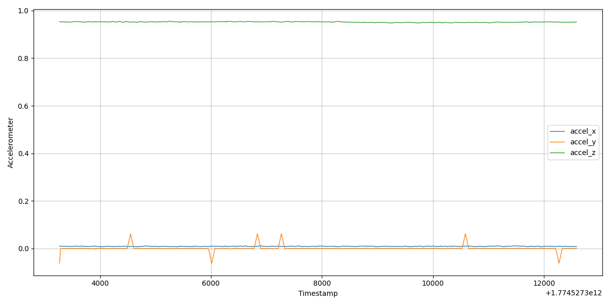
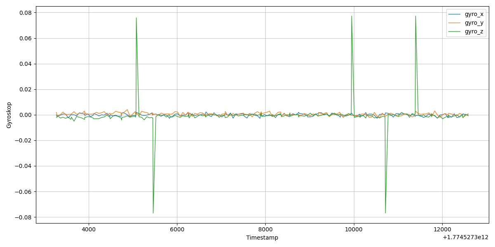
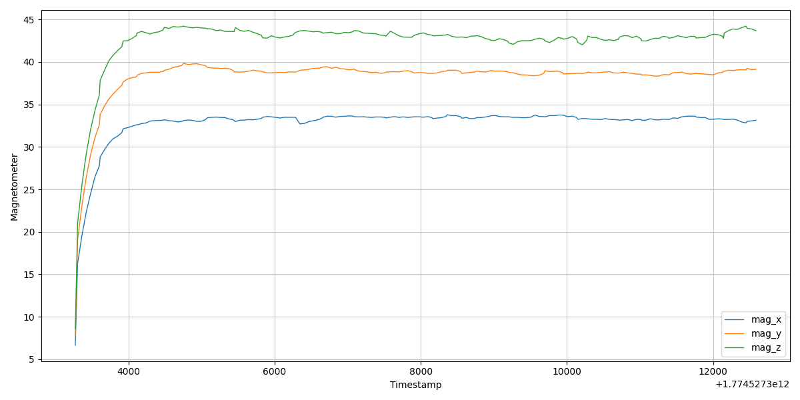

he couldn't find mr suchomel 

4h of pain bc wifi from babsi had no internet - connection worked though so I asked whether that's fine. he said yes. 5min later he told us to download a file from elearning, annoying ass.

# Get started

follow email instructions

add viz_IMU_data.py file from elearning to lesson 04 folder

# Go to logger.cpp and change content to this

bc we added lines and rewrote some stuff from his file (big irony right there since we JUST took it from his email)

```bash
#include "RTIMULib.h"

#include <iostream>
#include <fstream>
#include <chrono>
#include <memory>
#include <thread>

int const retNotFound = -1;
int const retInitFailed = -2;

int main() {
   auto settings = std::make_unique<RTIMUSettings>("RTIMULib");
   auto imu = std::unique_ptr<RTIMU>(RTIMU::createIMU(settings.get()));

   if (!imu || imu->IMUType() == RTIMU_TYPE_NULL) {
      std::cerr << "No IMU / Sense Hat found. \n";
      return retNotFound;
   }

   if (!imu->IMUInit()) {
      std::cerr << "IMUINit failed \n";
      return retInitFailed;
   }

   imu->setAccelEnable(true);
   imu->setGyroEnable(true);
   imu->setCompassEnable(true);

   std::cout << "IMU is being read. Cancel with Ctrl+C" << std::endl;

   std::ofstream file("data.csv", std::ios::trunc);
   if (!file.is_open()) {
      std::cerr << "failed to open the file. \n";
      return -3;
   }

   file << "timestamp_ms,accel_x,accel_y,accel_z,gyro_x,gyro_y,gyro_z,mag_x,mag_y,mag_z\n";

   while (true) {
       using namespace std::literals::chrono_literals;
       auto const poll_intervall = 50ms;

       std::this_thread::sleep_for(poll_intervall);

       while (imu->IMURead()) {
         const auto& data = imu->getIMUData();
         file << data.timestamp / 1000 << ",";

         if (data.accelValid && data.gyroValid && data.compassValid) {
            file << data.accel.x() << ",";
            file << data.accel.y() << ",";
            file << data.accel.z() << ",";

            file << data.gyro.x() << ",";
            file << data.gyro.y() << ",";
            file << data.gyro.z() << ",";

            file << data.compass.x() << ",";
            file << data.compass.y() << ",";
            file << data.compass.z() << "\n";

            file.flush(); // ensures that the data is written to the file
         } else
         {
            std::cerr << "Warning: Missing IMU Data\n";
         }

       }

   }
   return 0;
}
```

then go to terminal and do in the folder where the file is

```bash
kit-18@kit-18:~/Documents/EAI/Lesson_04 $ g++ -std=c++17 -o3 -Wall logger.cpp -o logger -I /usr/include/RTIMULib -lRTIMULib -lpthread
```

then do the command to execute the logger.cpp file

```bash
kit-18@kit-18:~/Documents/EAI/Lesson_04 $ ./logger
```

this now executes the measurement and stuff; exit whenever.

Now copy the csv file to your local machine (via clicking on the csv file in VSC and download) and execute the viz python file; you get three gorgeous graphs (eh)

should look like this:







# Moving on


```bash
kit-18@kit-18:~/Documents/EAI/Lesson_04 $ RTIMULibCal
RTIMULibCal - using RTIMULib.ini
Settings file RTIMULib.ini loaded
Using fusion algorithm RTQF
min/max compass calibration not in use
Ellipsoid compass calibration not in use
Accel calibration not in use
LSM9DS1 init complete

Options are: 

  m - calibrate magnetometer with min/max
  e - calibrate magnetometer with ellipsoid (do min/max first)
  a - calibrate accelerometers
  x - exit

Enter option: 
```

continue by entering any option
```bash
Enter option: m

Magnetometer min/max calibration
--------------------------------
Waggle the IMU chip around, ensuring that all six axes
(+x, -x, +y, -y and +z, -z) go through their extrema.
When all extrema have been achieved, enter 's' to save, 'r' to reset
or 'x' to abort and discard the data.

Press any key to start...
```

Now you get output; swiggle babsi around

```bash
Enter option: a

Accelerometer Calibration
-------------------------
The code normally ignores readings until an axis has been enabled.
The idea is to orient the IMU near the current extrema (+x, -x, +y, -y, +z, -z)
and then enable the axis, moving the IMU very gently around to find the
extreme value. Now disable the axis again so that the IMU can be inverted.
When the IMU has been inverted, enable the axis again and find the extreme
point. Disable the axis again and press the space bar to move to the next
axis and repeat. The software will display the current axis and enable state.
Available options are:
  e - enable the current axis.
  d - disable the current axis.
  space bar - move to the next axis (x then y then z then x etc.
  r - reset the current axis (if enabled).
  s - save the data once all 6 extrema have been collected.
  x - abort and discard the data.

Press any key to start...
```

now somehow configure the axis ? it didn't really work for me try again at home weird shit he was so speedy and just went through it.

after configured look at

```bash
nano RTIMULib.ini
```
this is where the config info is stored, which is loaded by default when we import the settings in logger.cpp eg