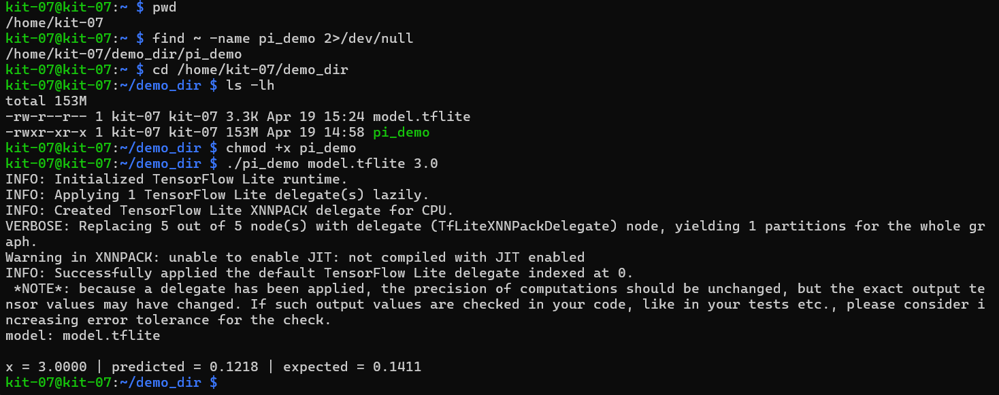

# Exercise 5 - Setting up Tensorflow on Bäbs and Bobs
**Date:** 16.04.  
**Group:** Binder, Kern, Salchegger  
**Time Estimate:** It took me 2-3 hours to run everything  

*Welcome to the final show, I hope you're wearing you're best clothes. ... Just stop you crying, it'll be alright....*


## Step 1: `train_and_convert.py` 

### Add the following function

```python
def make_model() -> tf.keras.Model:
    model = tf.keras.Sequential(
        [
            tf.keras.layers.Input(shape=(1,)),
            tf.keras.layers.Dense(16, activation="tanh"),
            tf.keras.layers.Dense(16, activation="tanh"),
            tf.keras.layers.Dense(1),
        ]
    )
    
    model.compile(
        optimizer=tf.keras.optimizers.Adam(learning_rate=0.01),
        loss="mse",
        metrics=["mse"],
    )
    return model
```

### **inside function** `def main() -> int` add the following:  
```python
# add model training and tflite conversion
    x, y = make_dataset() #was provided, sinusoidal signal, with added noise
    model = make_model() #created ourselves

    #fitting values
    model.fit(
        x,
        y,
        validation_split=0.2,
        epochs=20,
        batch_size=64,
        verbose=2,
        shuffle=True,
    )

    #export (ccan only create tensorflow lite model from saved model)
    tflite_path= artifacts_dir / "model.tflite"
    saved_model_dir = artifacts_dir / "saved_model"

    model.export(saved_model_dir) #write model to harddrive, necessary becasue can't convert it in the same instance (smaller version conversion)

    converter = tf.lite.TFLiteConverter.from_saved_model(str(saved_model_dir))
    tflite_model = converter.convert()
    tflite_path.write_bytes(tflite_model) #writes information within the model

    #test if model is correct (model prediction and sinusoidous prediction)
    sample = np.array([[3.0]], dtype=np.float32)

    prediction = model(sample, training=False).numpy().reshape(-1)[0] #provide x to our model, reshape,..

    print(f"Saved: {tflite_path}")
    print(f"Sanity check for x=3.0 -> predicted= {prediction:.4f}, expected ~= {np.sin(3.0):.4f}")
```

## Step 2: `main.cpp` everything we added during the lesson

```cpp
#include <cmath>
#include <iomanip>

int const retErrArg = -1;
int const retErrModel = -2;
int const retErrInterpret = -3;
int const retErrResize = -4;
int const retErrAlloc = -5;
int const retErrTensorNullptr = -6;
int const retErrInvoke = -7;

//GIVEN PARTS - missing here

// Load Model
auto model = tflite::FlatBufferModel::BuildFromFile(model_path.c_string());
if (!model) { // check if pointer is valid
    std::cerr << "Failed to load the model: " << model_path << "\n"; 
    return retErrModel;
}

//Build interpreter
tflite::ops::builtin::BuiltinOpResolver resolver;
std::unique_ptr<tflite::Interpret> interpreter;
tflite::InterpreterBuilder(*model, resolver)(&interpreter);

if (!interpreter) {
    std::cerr << "Failed to create the interpreter \n";
    return retErrInterpret;
}

// Resize tensor to [1, 1], batch size is 1
if (interpreter->ResizeInputTensor(interpreter->inputs()[0], {1, 1}) != kTfLiteOk) {
    std::cerr << "ResizeInputTensor() failed\n";
    return retErrResize;
}

// Allocate for Tensors
if (interpreter->AllocateTensors() != kTfLiteOk) {
    std::cerr << "AllocateTensors() failed\n";
    return retErrAlloc;
}

// Access model
float* input_tensor = interpreter->typed_input_tensor<float>(0);
float* output_tensor = interpreter->typed_output_tensor<float>(0);

//check for valid pointers
if (!input_tensor || !output_tensor) {
    std::cerr << "Tensor acccess failed\n";
    return retErrTensorNullptr;
}

// Set the input to the model
input_tensor[0] = input_value;

// Run Inference
if (interpreter->Invoke() != kTfLiteOk) {
    std::cerr << "Invoke() failed \n"; // idk why he used >> , probably wrong?
    return retErrInvoke;
}

// REead back the results from the model
float y_pred = output_tensor[0];
float y_true = std::sin(input_value);

std::cout << std::fixed << std::setprecision(4); //not really an output, but still writes it out (2 decimal places)
std::cout << "model: " << model_path << "\n\n";

//how closely we match with the model is one option but it is sufficient to just print out the value
std::cout << "x = " << input_value << 
    " | predicted = " << y_pred << 
    " | expected = " << y_true << "\n";

```
## Step 3: Open the Terminal and run the following command
First update the `.env` with the correct `PI_HOST` and `PI_USER`.

```bash
pip install -r requirements.txt

# or if that doesn't work
bash .devcontainer/init.sh
``` 

## Step 4: Run task...
Click on the `+` sign in the terminal and then on `Run Task...`.  
- Choose `train model`  
- Then let it train and finish, afterwards do the same and click `build`.

## Step 5: Connect the Raspberri Pi
Click on the `+` sign in the terminal and then on `Run Task...`.  
- Choose `deploy`  
- Afterwards choose `console`


## Step 6: Finish SetUp -> connect to the Raspberry Pi via e.g. cmd
Follow the commands in the screenshot below, to finish and check if everything went well.  


